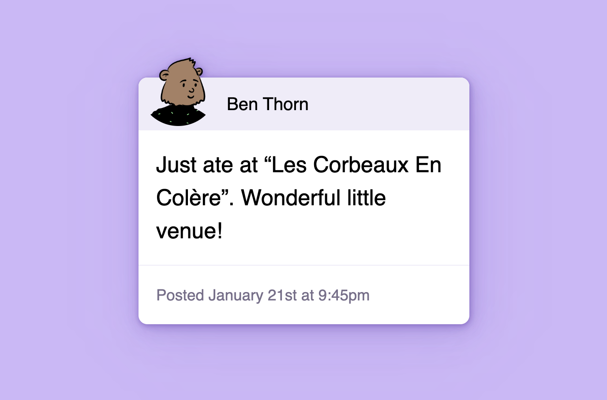
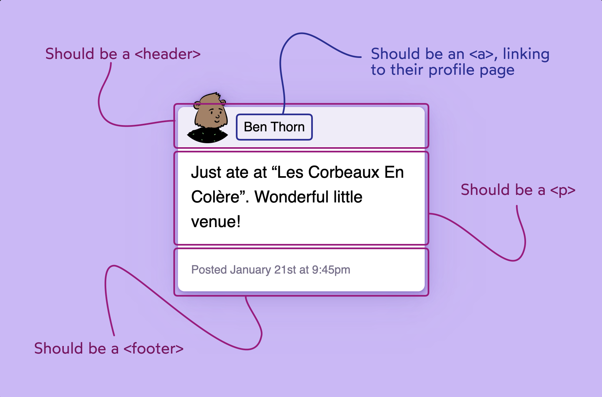

# JSX

## Form

All of the necessary styles have been provided. You'll need to add 3 elements right inside the <form> tag:

A label
A text input
A button, with the class submit-btn


- The UI should match the screenshot above
- The label should be attached to the input; clicking the label text should focus the input
- The button should have the appropriate styles, applied with the class submit-btn.

---

## Critter

You've been given two things:

1. A message object, containing all the data you'll need to populate the UI
2. A bunch of styles, so you don't have to worry about any of the CSS.



For the styles to be correctly applied, you'll need to follow a specific semantic markup:



- The UI should match the mockup, using the data from the message object
- The user's avatar should have helpful descriptive alt text
- The user's name should be a link, and it should link to /users/[username]. With this data, it should be /users/benjaminthorn.
- There is no actual "profile page", and so the link won't resolve to anything. That's alright.
- The footer should include the word “Posted” before the published date.

<!-- ```js
export const Form = () => {
  return (
    <form>
      <label htmlFor="search-input">Search:</label>
      <input id="search-input" />
      <button className="submit-btn">Submit</button>
    </form>
  );
};
```

```js
export const Critter = () => {
  return (
    <article>
      <header>
        
        <a href={profileUrl}>{message.author.name}</a>
      </header>
      <p>{message.content}</p>
      <footer>Posted {message.published}</footer>
    </article>
  );
};
``` -->
